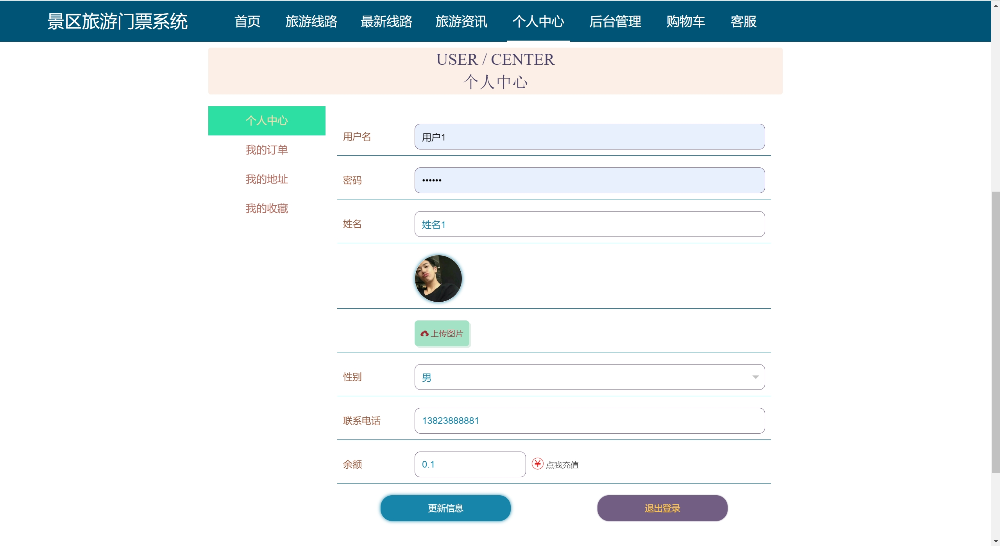

## 基于Java+Springboot+Vue的景区旅游门票管理系统(源代码+数据库)130

## 一、系统介绍
本项目前后端分离，分为管理员、用户两种角色

### 1、用户：
- 注册、登录、旅游线路查询、线路购买、购物车、旅游咨询、客服咨询、地址管理、充值、订单管理、个人中心、个人收藏管理、密码修改
### 2、管理员：
- 用户管理、线路分类管理、旅游线路管理、最新线路管理、轮播图管理、旅游资讯管理、客服管理、订单管理

## 二、所用技术

后端技术栈：

- Springboot
- MybatisPlus
- Mysql
- Maven

前端技术栈：

- Vue 
- Vue-router 
- axios 
- element-ui

## 三、环境介绍

基础环境 :IDEA/eclipse, JDK1.8, Mysql5.7及以上,Maven3.6, node14，navicat

所有项目以及源代码本人均调试运行无问题 可支持远程调试运行

## 四、页面截图
### 1、用户

### 2、管理员：

## 五、浏览地址

前台访问地址：http://localhost:8080/springbootmt74k/front/index.html
- 用户账号/密码：用户1/123456

后台访问地址：http://localhost:8081/
- 管理员账号/密码：abo/abo

## 六、部署教程
1. 使用Navicat或者其它工具，在mysql中创建对应名称的数据库，并执行项目的sql文件
2. 使用IDEA/Eclipse导入springbootmt74k项目，若为maven项目请选择maven，等待依赖下载完成
3. 进入src/main/resources修改application.yml里面的数据库配置
4. src/main/java/com/SpringbootSchemaApplication.java启动后端项目
5. vscode或idea打开admin项目
6. 在编译器中打开terminal，执行npm install 依赖下载完成后执行 npm run serve,执行成功后会显示访问地址

